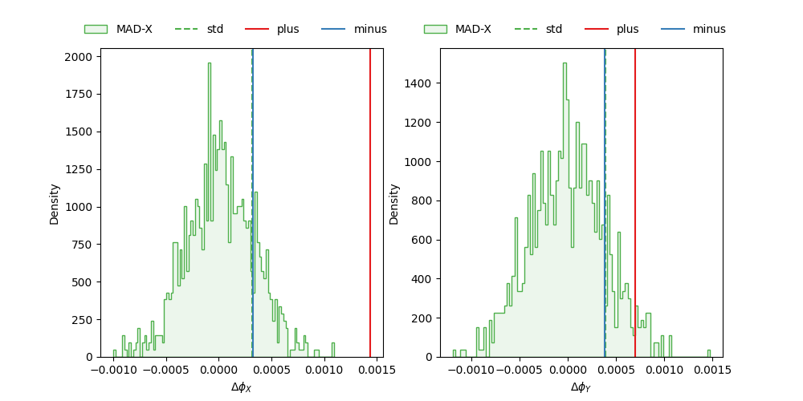

# Phase Error Propagation

## Motivation 

This small study aims to investigate how phase errors, 
determined by the errors on alpha and beta of the boundary conditions,
propagate through the lattice.

In particular, this is a test whether the first plus-sign in 
Eq. (2) of 10.18429/JACOW-IPAC2015-MOPJE054  
( http://jacow.org/ipac2015/doi/JACoW-IPAC2015-MOPJE054.html )
should in fact be a minus sign:
Suitable alpha0 and beta0, means and standard deviations, 
are choosen and realized as boundary conditions for the FODO-lattice from 
gaussian distributions.
From the resulting phase advance distributions, 
shifted to zero by the phase advance of the realization with only mean-values, 
the standard deviation is calculated and compared to
the analytically propagated results.

The resulting plots show that, indeed, the error propagation formular with
a negative sign is the correct one.

## Setup

Python 3.7+ is required and the dependencies can be installed from the `requirements.txt`. 
This file contains the exact versions this script has been tested with, but it might run with newer
versions as well.